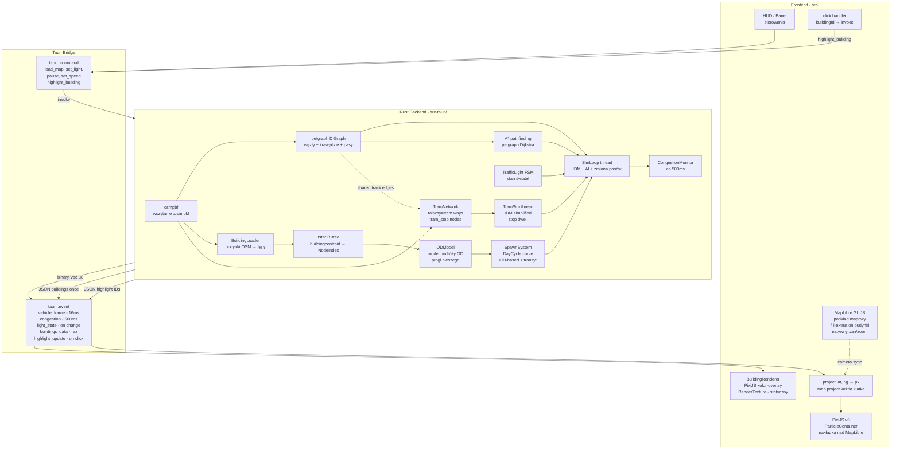

# Traffic Control 2D Game - Plan

## Stos technologiczny

| Warstwa | Technologia | Rola |
|---|---|---|
| Framework desktopowy | **Tauri v2** | Okno, system plików, bridge Rust↔JS |
| Silnik symulacji | **Rust** (osobny thread) | IDM physics, AI, pathfinding, spawning, congestion |
| Dane OSM | **osmpbf** (Rust crate) | Wczytanie pliku `.osm.pbf`, parsowanie węzłów/krawędzi/budynków |
| Graf dróg | **petgraph** (Rust crate) | DiGraph dróg, algorytm A* (Dijkstra) |
| Przestrzenne wyszukiwanie | **rstar** (Rust crate) | R-tree dla budynków → najbliższy węzeł drogi, O(log n) |
| Podkład mapowy | **MapLibre GL JS** | Wektorowe kafelki OSM, natywny pan/zoom, **fill-extrusion budynków** |
| Silnik 2D | **PixiJS v8** | Pojazdy, światła, UI - canvas nakładka nad MapLibre |
| Build frontend | **Vite + TypeScript** | HMR, typy |

## Architektura systemu



## Struktura projektu

```
ai-tests-5-traf/
├── src-tauri/                         # Rust backend
│   ├── Cargo.toml                     # osmpbf, petgraph, rstar, serde, rayon, tokio
│   └── src/
│       ├── main.rs                    # Tauri builder, command registration
│       ├── commands.rs                # #[tauri::command] handlers
│       ├── map/
│       │   ├── osm_loader.rs          # osmpbf → raw nodes/ways/relations
│       │   ├── road_network.rs        # petgraph DiGraph, RoadEdge (pasy, oneway, bridge, tunnel, layer)
│       │   ├── building_loader.rs     # osmpbf building=* → Building{id,polygon,type,access_node}
│       │   ├── building_network.rs   # rstar R-tree: centroid → nearest road NodeIndex, O(log n)
│       │   └── tram_network.rs       # railway=tram → TramGraph + TramStop, shared track detection
│       ├── simulation/
│       │   ├── sim_loop.rs            # Pętla w std::thread, emituje events
│       │   ├── idm.rs                 # a = a_max*(1-(v/v0)^4-(s*/s)^2)
│       │   ├── lane_change.rs         # Punkty 25/50/75%, safe gap, późny wybór
│       │   ├── pathfinding.rs         # A* z wagą = length/lerp(REF_SPEED, max_speed, route_alpha)
│       │   ├── spatial_grid.rs        # Siatka komórek O(1) wyszukiwania sąsiadów
│       │   ├── spawn.rs               # SpawnSystem + DayCycle curve + OD-based + transit
│       │   ├── od_model.rs            # ODModel: generowanie par OD, progi pieszego, typy podróży
│       │   ├── speed_config.rs        # SpeedConfig + ComplianceRange + RouteConfig + RageConfig
│       │   ├── tram_sim.rs            # TramSim: IDM uproszczony + stop dwell + współdzielony tor
│       │   └── congestion.rs          # congestionLevel per edge, alerty
│       ├── traffic/
│       │   ├── traffic_light.rs       # FSM: Green→Yellow→Red, 4 tryby
│       │   └── intersection.rs        # Klasyfikacja: lights/stop/yield/equal
│       └── vehicles/
│           ├── vehicle.rs             # VehicleState: id,lat,lng,angle,speed,type,frustration,trip_kind,personal_compliance,route_alpha,standstill_time,same_intersection_stops
│           ├── types.rs               # Car/Van/Bus/Truck/Tram - wymiary, v0, a_max
│           └── driver.rs             # Normal/Sunday/Pirat/Cautious - parametry IDM
│
├── src/                               # Frontend TypeScript
│   ├── main.ts                        # Init MapLibre + PixiJS + Tauri bridge
│   ├── map/
│   │   └── MapLibreSetup.ts           # Styl mapy, PMTiles/online tiles, listenery kamery
│   ├── rendering/
│   │   ├── PixiOverlay.ts             # Canvas abs. positioned nad MapLibre, sync rozmiaru
│   │   ├── VehicleRenderer.ts         # ParticleContainer, project() lat/lng→px, frustum cull
│   │   ├── BuildingRenderer.ts        # Kontury budynków → RenderTexture (1 draw call), color by type
│   │   ├── InfraRenderer.ts           # Strzałki oneway, wiadukty (cień), tunele (dashed)
│   │   ├── CongestionRenderer.ts      # Czerwone/żółte linie + edge indicators na ramce
│   │   └── UIRenderer.ts             # HUD: satisfaction, zegar gry, panel świateł
│   ├── traffic/
│   │   └── TrafficLightUI.ts          # Kliknięcie na skrzyżowanie → invoke set_light
│   ├── buildings/
│   │   └── BuildingInteraction.ts     # map.on('click','building') → invoke highlight_building, highlight_update listener
│   ├── time/
│   │   └── GameClockUI.ts            # Wyświetlanie czasu gry, suwak prędkości, pauza
│   └── bridge/
│       ├── commands.ts               # Typowane invoke() wrappery
│       └── events.ts                 # Typowane listenery na vehicle_frame, congestion
│
├── assets/maps/                       # Pliki .osm.pbf
│   └── krakow-center.osm.pbf
├── index.html
├── package.json
├── vite.config.ts
└── tsconfig.json
```

## Kluczowe mechaniki

### Integracja MapLibre ↔ PixiJS

Kluczowy problem: MapLibre i PixiJS mają osobne systemy współrzędnych.

- PixiJS `<canvas>` nakładany absolutnie nad MapLibre `<canvas>` (`z-index` wyższy, `pointer-events: none` na PixiJS - kliknięcia przechodzą do MapLibre)
- Pojazdy trzymają pozycje w `(lat, lng)` (Rust wysyła geo-współrzędne)
- Każdą klatkę: `const px = map.project([lng, lat])` → `{x, y}` → pozycja w PixiJS
- Gdy MapLibre zmienia kamerę (`map.on('render')`): PixiJS natychmiast przelicza wszystkie pozycje - nie trzeba żadnej własnej kamery w PixiJS
- Pan/zoom obsługuje **wyłącznie MapLibre** (myszka, klawiatura) - PixiJS nie potrzebuje `pixi-viewport`

### Protokół komunikacji Rust → Frontend

Symulacja w Rust emituje zdarzenia przez Tauri:

```
buildings_data (raz przy starcie):
  JSON: [{ id: u64, polygon: [[lng,lat],...], type: "residential"|"commercial"|"office"|"other" }]

vehicle_frame (co ~16ms):
  binary payload: [id:u32, lat:f32, lng:f32, angle:f32, speed:f32, type:u8, trip_kind:u8, padding:u16, satisfaction:f32] × N

congestion_update (co 500ms):
  JSON: { edge_id: u64, level: f32, lat: f32, lng: f32}[]

light_state_change (na zmianę fazy):
  JSON: { intersection_id: u64, phase: u8, time_remaining: f32 }

highlight_update (po invoke highlight_building):
  JSON: { building_id: u64, vehicle_ids: u32[] }
  → frontend podświetla te pojazdy, pozostałe alpha 0.4

tram_stop_update (na każde zatrzymanie tramwaju na przystanku):
  JSON: { stop_id: u64, tram_id: u32, boarded: u16, alighted: u16, waiting: u16 }

game_over (jednorazowy gdy warunek przegranej):
  JSON: { reason: "avg_frustration"|"mass_rage", value: f32, timestamp_game: f32 }
```

**Tauri commands (Frontend → Rust):**
```
load_map(bbox)              - wczytanie obszaru
set_light(id, phase)        - sterowanie światłem
pause / set_speed           - pauza i timeScale
highlight_building(id)      - zaznacz budynek i pojazdy OD, id=null kasuje highlight
set_speed_config(config)    - zmiana SpeedConfig (limity i compliance) bez restartu symulacji
```

`vehicle_frame` wysyłany jako `Vec<u8>` (zero-copy, brak JSON overhead) - frontend parsuje przez `DataView`. `trip_kind`: 0=local_od, 1=transit, 2=external_inbound, 3=external_outbound.

### Fizyka pojazdów - IDM
Model zapewnia realistyczne przyspieszanie i hamowanie:
- `a = a_max × [1 − (v/v₀)⁴ − (s*/s)²]`
- `s* = s₀ + v·T + v·Δv / (2√(a_max·b))`
- `v₀` = **prędkość pożądana kierowcy** = `edge.max_speed × driver.speed_compliance_factor` - patrz sekcja "Prędkości i przestrzeganie przepisów"
- Parametry (`v₀`, `T`, `a_max`, `b`) różne dla każdego typu pojazdu i profilu kierowcy

### Graf dróg z OSM (Rust)

```rust
// road_network.rs
struct RoadNode { id: u64, lat: f64, lng: f64, intersection_type: IntersectionType }
struct RoadEdge {
    lanes: u8, max_speed: f32, oneway: bool,
    infra: InfraType,  // Normal | Bridge(layer) | Tunnel(layer)
    lane_directions: Vec<LaneDir>,  // [Left, Straight, Right] per pas
    decision_points: [f32; 3],  // [0.25, 0.50, 0.75] × edge length
}
enum IntersectionType { TrafficLight, Stop, Yield, Equal }
type RoadGraph = petgraph::Graph<RoadNode, RoadEdge, Directed>;
```

- Overpass API pobiera `way[highway]`, `node[traffic_signals]`, `node[stop]`, `node[give_way]`, tagi `oneway`, `bridge`, `tunnel`, `layer`, `lanes`, `maxspeed`, `maxspeed:urban`, `zone:traffic`
- `RoadEdge.max_speed` wyznaczana wg priorytetu: (1) tag `maxspeed` → (2) `zone:traffic=urban/rural` + typ drogi → (3) heurystyka urban/rural z gęstości węzłów - patrz sekcja "Prędkości"
- `RoadEdge` rozszerzone o pole `urban: bool` - wpływa na default speed limit gdy brak tagu `maxspeed`
- A* przez `petgraph::algo::astar` z wagą = czas przejazdu (`length / max_speed`)
- Graf budowany raz przy starcie, trzymany w `Arc<RwLock<RoadGraph>>`

### Prędkości i przestrzeganie przepisów

#### Tabela limitów prędkości (`road_network.rs` - `parse_max_speed`)

Priorytety przy wyznaczaniu `max_speed` dla krawędzi:

1. **Tag `maxspeed` w OSM** - bezwzględny priorytet, przeliczany na m/s
2. **Strefa `zone:traffic=living_street`** → 30 km/h
3. **Typ drogi + kontekst urban/rural** (fallback gdy brak `maxspeed`):

| highway type | lanes | urban | limit |
|---|---|---|---|
| `living_street` | dowolna | tak | 20 km/h |
| `residential` / `service` | dowolna | tak | 30 km/h |
| `unclassified` / `tertiary` | 1 | tak | 50 km/h |
| `tertiary` / `secondary` | 2 | tak | 70 km/h |
| `secondary` / `primary` | ≥3 | tak | 70 km/h |
| `motorway` / `trunk` | dowolna | tak (obwodnica) | 120 km/h |
| `unclassified` / `tertiary` | 1 | nie (rural) | 90 km/h |
| `secondary` / `primary` | 2–3 | nie (rural) | 90 km/h |
| `motorway` / `trunk` | ≥2 | nie (rural) | 140 km/h |

Wszystkie wartości zapisane w `SpeedConfig` - modyfikowalne bez rekompilacji.

#### Detekcja urban/rural

Brak w OSM jednolitego tagu "jesteś w mieście". Heurystyka w `road_network.rs`:

```rust
// Krok 1: explicit tags (OSM Poland stosuje je rzadko)
if tags.get("zone:traffic") == Some("urban")   { return true  }
if tags.get("zone:traffic") == Some("rural")   { return false }
if tags.get("maxspeed:type") == Some("PL:urban") { return true }

// Krok 2: heurystyka na podstawie zagęszczenia węzłów grafu w promieniu 200m
// (budowana po przejściu wszystkich węzłów przez rstar R-tree)
// gęstość > 0.02 węzła/m² → urban
```

Wartość `urban: bool` zapisywana raz w `RoadEdge` przy budowaniu grafu.

#### Konfiguracja prędkości (`SpeedConfig`)

Nowy plik `simulation/speed_config.rs` - pojedyncza struktura trzymana w `Arc<RwLock<SpeedConfig>>`, modyfikowalna przez Tauri command `set_speed_config`:

```rust
// speed_config.rs
#[derive(Debug, Clone, Serialize, Deserialize)]
pub struct SpeedConfig {
    // Limity domyślne [km/h] - urban
    pub urban_1lane:      f32,  // default: 50
    pub urban_2lane:      f32,  // default: 70
    pub urban_3lane_plus: f32,  // default: 70
    pub urban_motorway:   f32,  // default: 120
    pub urban_residential:f32,  // default: 30
    pub urban_living:     f32,  // default: 20

    // Limity domyślne [km/h] - rural
    pub rural_1lane:      f32,  // default: 90
    pub rural_2lane_plus: f32,  // default: 90
    pub rural_motorway:   f32,  // default: 140

    // Zgodność z przepisami per profil: bazowy mnożnik (> 1.0 = przekraczanie)
    pub compliance_normal:   ComplianceRange,
    pub compliance_sunday:   ComplianceRange,
    pub compliance_pirat:    ComplianceRange,
    pub compliance_cautious: ComplianceRange,

    // Odchylenie losowe (sigma Gaussa) - ta sama dla wszystkich profili (ale skalowana)
    pub noise_sigma: f32,       // default: 0.04  (±4% odchylenie)
}

#[derive(Debug, Clone, Serialize, Deserialize)]
pub struct ComplianceRange {
    pub base: f32,     // bazowy mnożnik prędkości dla profilu
    pub min:  f32,     // minimum po noise
    pub max:  f32,     // maksimum po noise
}
```

Domyślne wartości `ComplianceRange` per profil:

| Profil | `base` | `min` | `max` | Opis |
|---|---|---|---|---|
| `Normal` | 1.10 | 0.95 | 1.20 | jedzie ~10% powyżej, czasem zgodnie |
| `Sunday` | 0.95 | 0.85 | 1.05 | przeważnie wolniej lub przepisowo |
| `Pirat` | 1.35 | 1.15 | 1.60 | mocno przekracza, duże odchylenie |
| `Cautious` | 0.92 | 0.85 | 1.00 | jedzie poniżej lub na limicie |

#### Obliczanie `v₀` przy spawnie pojazdu

Każdy pojazd w momencie spawnu losuje raz swój `personal_compliance: f32` i trzyma go przez całe życie:

```rust
// spawn.rs - przy tworzeniu VehicleState
fn sample_compliance(profile: DriverProfile, config: &SpeedConfig, rng: &mut impl Rng) -> f32 {
    let range = config.compliance_for(profile);
    // Gaussowskie odchylenie wokół base, przycięte do [min, max]
    let noise: f32 = rng.sample::<f32, _>(StandardNormal) * config.noise_sigma;
    (range.base + noise).clamp(range.min, range.max)
}
```

Prędkość pożądana na danym odcinku = `edge.max_speed × personal_compliance`.

Zmieniając `noise_sigma = 0.0` wszystkie pojazdy tego samego profilu jeżdżą identycznie. Zmieniając `noise_sigma = 0.15` populacja tego samego profilu ma dużą wariancję.

#### `VehicleState` - nowe pole

```rust
// vehicle.rs
pub struct VehicleState {
    // ... istniejące pola ...
    pub personal_compliance: f32,  // losowane raz przy spawnie, trzymane przez życie
    pub route_alpha: f32,          // [0.0=najkrótsza .. 1.0=najszybsza], losowane przy spawnie
}
```

`v₀` wyznaczane co klatce: `let v0 = current_edge.max_speed * vehicle.personal_compliance;`

`route_alpha` używane **wyłącznie w A*** przy wyznaczaniu trasy (jednorazowo przy spawnie).

### Budynki jako punkty OD (Origin-Destination)

#### Ekstrakcja budynków z OSM (Rust)

`building_loader.rs` parsuje z pliku `.osm.pbf` wszystkie waye z tagiem `building=*` oraz `amenity`, `shop`, `office`:

```rust
// building_loader.rs
struct Building {
    id: u64,
    polygon: Vec<(f64, f64)>,   // wierzchołki konturu (lat, lng)
    centroid: (f64, f64),       // środek ciężkości
    building_type: BuildingType,
    access_node: NodeIndex,     // najbliższy węzeł drogi w grafie
}

enum BuildingType {
    Residential,   // building=residential/apartments/house/detached
    Commercial,    // building=commercial, shop=*, amenity=supermarket/mall
    Office,        // building=office, office=*, amenity=bank/government
    Other,         // wszystko pozostałe
}
```

`building_network.rs` dla każdego budynku wyszukuje **przez `rstar` R-tree** najbliższy węzeł drogi (`access_node`) w czasie O(log n) - pojazd generowany dla tej podróży startuje od tego węzła lub do niego jedzie. R-tree budowany raz przy starcie z centroidów wszystkich węzłów drogowych, trzymany w `Arc<RTree<RoadNodePoint>>`. Dla całego Krakowa Śródmieścia (~2000 budynków, ~5000 węzłów) czas inicjalizacji < 50ms.

#### Model podróży OD (`od_model.rs`)

Każda podróż samochodem to para `(origin_building_id, dest_building_id, trip_type)`. Generowanie par zależy od godziny w DayCycle:

```
TripType:
  HomeToWork    - Residential → Office      (06:00–09:30, rush poranny)
  WorkToHome    - Office → Residential      (16:00–18:30, rush wieczorny)
  HomeToShop    - Residential → Commercial  (10:00–13:00, 17:00–19:00)
  ShopToHome    - Commercial → Residential  (11:00–14:00, 18:00–20:00)
  LunchTrip     - Office/Residential → Commercial (12:00–13:30)
  Transit       - boundary node → boundary node (bez budynku, przelotowy)
```

Każdy budynek Residential ma losowo przypisany budynek Office (lub Commercial) jako "stały cel" (np. praca / ulubiony sklep) - przypisanie generowane raz przy starcie symulacji. Dzięki temu te same "osoby" dojeżdżają codziennie tą samą trasą.

#### Próg pieszego

Przed wygenerowaniem pojazdu sprawdzane jest odległość euklidesowa między centroidami budynków:

```rust
// od_model.rs
const WALK_THRESHOLD_M: f64 = 400.0;  // konfigurowalne

fn should_drive(origin: &Building, dest: &Building) -> bool {
    haversine_distance(origin.centroid, dest.centroid) > WALK_THRESHOLD_M
}
```

Jeśli `distance < WALK_THRESHOLD_M` → podróż pomijana (agent idzie pieszo, brak spawnu pojazdu). Wartość ~400m odpowiada realnym zachowaniom miejskim.

#### Ruch tranzytowy

Pojazdy tranzytowe **nie mają budynku** jako celu - startują i kończą na węzłach granicznych obszaru mapy (boundary nodes - skrajne węzły grafu przy krawędzi bounding box). Dwa warianty:

- **Pure transit** - wjazd z jednej strony obszaru, wyjazd inną stroną (np. przejazd przez centrum)
- **Dojazd z zewnątrz** - wjazd z granicy → docelowy budynek w centrum (Office/Commercial)
- **Wyjazd do zewnątrz** - budynek w centrum → wyjazd za granicę obszaru

Proporcje w SpawnSystem (konfigurowalne):
```
60% - podróże OD między budynkami (lokalni mieszkańcy/pracownicy)
25% - pure transit (przejazd przez obszar)
15% - dojazd/wyjazd zewnętrzny (dojeżdżający spoza obszaru)
```

`TripKind` dołączane do `VehicleState` w payloadzie binarnym (dodatkowy bajt `trip_kind: u8`) - frontend może wizualnie odróżniać typy pojazdów jeśli potrzebne.

#### Rendering budynków - strategia dwuwarstwowa

**Warstwa 1: MapLibre GL (primary - zero kosztu PixiJS)**

MapLibre renderuje budynki natywnie z wektorowych kafelków OSM. Przy starcie `MapLibreSetup.ts` nadpisuje styl warstwy `building` data-driven paint:

```typescript
// MapLibreSetup.ts - data-driven styling na podstawie buildings_data
map.setPaintProperty('building', 'fill-extrusion-color', [
  'match', ['get', 'building_game_type'],   // property dodane przez setFeatureState
  'residential', '#E8C87A',
  'commercial',  '#7AB8E8',
  'office',      '#A0B0C0',
  /* default */ '#CCCCCC'
]);
map.setPaintProperty('building', 'fill-extrusion-height', ['get', 'height']);
map.setPaintProperty('building', 'fill-extrusion-opacity', 0.75);
```

Po odebraniu `buildings_data` z Rusta: `map.setFeatureState({ source: 'openmaptiles', sourceLayer: 'building', id: building_id }, { building_game_type: type })`. MapLibre automatycznie obsłuży wszystkie tysiące budynków w jednym draw callu GPU - **zero PixiJS overhead** dla statycznego wyglądu.

Zalety: fill-extrusion daje efekt pseudo-3D (widoczna wysokość budynku), natywny pan/zoom bez żadnego przeliczania po stronie TS.

**Warstwa 2: PixiJS overlay (game state - tylko highlight)**

`BuildingRenderer.ts` **nie rysuje** wszystkich budynków - tylko te aktualnie podświetlone (po kliknięciu). Jeden `Graphics` → `RenderTexture` per podświetlony budynek, automatycznie czyszczony po 5s lub po kliknięciu innego budynku.

Budynki wysyłane z Rust **jednorazowo** przy starcie jako event `buildings_data`:

```typescript
interface BuildingData {
  id: number;
  polygon: [number, number][];  // [[lng, lat], ...]
  type: 'residential' | 'commercial' | 'office' | 'other';
}
```

#### Interakcja: klik budynku → podświetlenie pojazdów

Kliknięcie na budynek (obsługiwane przez MapLibre `queryRenderedFeatures`) wywołuje Tauri command:

```typescript
// TrafficLightUI.ts / BuildingInteraction.ts
map.on('click', 'building', (e) => {
  const buildingId = e.features[0].id as number;
  invoke('highlight_building', { building_id: buildingId });
  // podświetl sam budynek w PixiJS (bright ring)
  buildingRenderer.highlight(buildingId, e.features[0].geometry);
});
```

Po stronie Rust `commands.rs` obsługuje `highlight_building`:

```rust
// commands.rs
#[tauri::command]
fn highlight_building(building_id: u64, state: State<SimState>) {
    let sim = state.sim.write();
    sim.set_highlight_building(Some(building_id));
    // SimLoop w kolejnej klatce znajdzie wszystkie pojazdy zmierzające
    // do/z building_id i oznaczy je flagą highlighted=true
}
```

SimLoop wysyła event `highlight_update` z listą ID pojazdów do podświetlenia:

```
highlight_update (na zmianę highlight_building):
  JSON: { building_id: u64, vehicle_ids: u32[] }
```

Frontend (PixiJS) zmienia kolor sprite'a podświetlonych pojazdów na jaskrawy (np. żółty), pozostałe przyciemnia (alpha 0.4). Highlight kasowany po kliknięciu pustego obszaru lub innego budynku.

### Tryby sterowania światłami
- **Ręczny** - gracz klikając zmienia fazę
- **Półautomatyczny** - gracz ustawia czasy faz, automat je wykonuje
- **Automatyczny (fixed-time)** - predefiniowane cykle
- **Adaptacyjny (czujniki)** - czas fazy zależy od liczby aut w kolejce (sensor loop)

### System frustracji - Traffic Rage Meter

Każdy pojazd ma `frustration: f32 (0.0–100.0)` liczony w Rust (zastępuje poprzednią nazwę `satisfaction` - wyżej = gorzej). Wysyłany w polu `satisfaction` binarnego pakietu (odwrócona interpretacja po stronie frontendu: `frustration = 100 - satisfaction`).

#### Trzy źródła wzrostu frustracji

**1. Stanie w miejscu (wykładnicze)**

```rust
// sim_loop.rs - co tick symulacji
if vehicle.speed < 0.5 {  // m/s - stoi
    vehicle.standstill_time_real_s += dt_real;
    let t = vehicle.standstill_time_real_s;
    let threshold = profile.wait_threshold_real_s;
    // Liniowy wzrost do progu, potem wykładniczy
    let rate = if t < threshold {
        profile.decay_rate_linear           // np. 0.5/s realnych dla Normal
    } else {
        profile.decay_rate_linear * (1.0 + ((t - threshold) / threshold).powi(2))
    };
    vehicle.frustration = (vehicle.frustration + rate * dt_real).min(100.0);
} else {
    vehicle.standstill_time_real_s = 0.0;  // reset po ruszeniu
    vehicle.frustration = (vehicle.frustration - profile.recovery_rate * dt_real).max(0.0);
}
```

`wait_threshold_real_s` per profil:
- Normal: 45s, Sunday: 90s, Pirat: 15s, Cautious: 60s

**2. Pełzanie** (powolna jazda bez pełnego zatrzymania)

```rust
// Pełzanie: jedzie, ale poniżej 20% limit speed przez >10s
let crawl_speed = edge.max_speed * 0.20;
if vehicle.speed > 0.5 && vehicle.speed < crawl_speed {
    vehicle.crawl_time_real_s += dt_real;
    if vehicle.crawl_time_real_s > profile.crawl_threshold_s {  // np. 10s
        // Frustracja rośnie wolniej niż stanie, ale stale
        vehicle.frustration += profile.crawl_rate * dt_real;
    }
} else {
    vehicle.crawl_time_real_s = 0.0;
}
```

**3. Wielokrotne zatrzymanie na tym samym skrzyżowaniu**

`VehicleState` przechowuje `last_intersection_id: Option<u64>` i `same_intersection_stops: u8`:

```rust
if vehicle.speed < 0.5 && vehicle.is_at_intersection() {
    let iid = vehicle.current_intersection_id();
    if vehicle.last_intersection_id == Some(iid) {
        vehicle.same_intersection_stops += 1;
        // Bonus frustracja za każdy kolejny cykl czerwonego na tym samym skrzyżowaniu
        let bonus = profile.repeat_stop_bonus * vehicle.same_intersection_stops as f32;
        vehicle.frustration = (vehicle.frustration + bonus).min(100.0);
    } else {
        vehicle.last_intersection_id = Some(iid);
        vehicle.same_intersection_stops = 1;
    }
}
```

`repeat_stop_bonus` per profil: Normal=2.0, Pirat=8.0, Sunday=0.5, Cautious=1.0

#### Progi wizualne i stany

| `frustration` | Stan | Kolor dymka | Efekt PixiJS |
|---|---|---|---|
| 0–40 | Spokojny | brak | brak |
| 40–65 | Zniecierpliwiony | żółty `!` | mały dymek pulsujący |
| 65–85 | Sfrustrowany | pomarańczowy `!!` | większy dymek |
| 85–99 | Wściekły | czerwony `!!!` | duży dymek + szybkie pulsowanie |
| 100 | Rage quit | czerwony `💢` + miganie | pojazd "wysiada" z symulacji (despawn) |

#### Warunki przegranej

```
PRZEGRANA gdy:
  (1) średnia frustracja wszystkich aktywnych pojazdów > 80.0  (przez ≥30s realnych)
  (2) LUB więcej niż 5% aut jednocześnie ma frustration == 100.0
```

Warunek (1) daje graczowi czas na reakcję (30s realne). Warunek (2) chroni przed nagłym spike'iem.

Rust emituje event `game_over` gdy któryś warunek spełniony:
```
game_over (jednorazowy):
  JSON: { reason: "avg_frustration"|"mass_rage", value: f32, timestamp_game: f32 }
```

#### Wizualizacja dymków w PixiJS (`VehicleRenderer.ts`)

Dymki **nie są** w `ParticleContainer` (brak wsparcia dla złożonych grafik). Renderowane jako osobna `Container` z prerenderedowanymi `RenderTexture` per stan (4 tekstury: żółta, pomarańczowa, czerwona, rage):

```typescript
// VehicleRenderer.ts
// Dymek wyświetlany gdy frustration > 40
// Pozycja: nad pojazdem (+8px w górę po project())
// Przeliczane co klatkę jak pozycja pojazdu (przez transformMatrix)
// Tekstura wybierana raz przy przekroczeniu progu, nie co klatkę
```

Łącznie dymki to dodatkowy Layer 4c (lub wbudowany w Layer 4 z osobnym `Container`). Koszt: ~1 dodatkowy draw call dla wszystkich dymków gdy `Container` zbatchowany.

Flaga `frustration` dodana do binarnego pakietu - JUŻ JEST jako `satisfaction` w bajcie 24-27 (zreinterpretowane: 0.0 = spokojny, 100.0 = rage).

#### Parametry w `SpeedConfig` / `RageConfig`

Nowy blok w `speed_config.rs`:

```rust
pub struct RageConfig {
    pub standstill_threshold_s:  [f32; 4],  // per profil [Normal, Sunday, Pirat, Cautious]
    pub decay_rate_linear:       [f32; 4],  // frustracja/s przy staniu
    pub recovery_rate:           [f32; 4],  // frustracja/s przy jeździe
    pub crawl_fraction:          f32,       // default: 0.20 (20% limitu = pełzanie)
    pub crawl_threshold_s:       f32,       // default: 10.0s
    pub crawl_rate:              [f32; 4],  // frustracja/s przy pełzaniu
    pub repeat_stop_bonus:       [f32; 4],  // bonus per kolejny cykl na skrzyżowaniu
    pub global_loss_threshold:   f32,       // default: 80.0
    pub global_loss_duration_s:  f32,       // default: 30.0
    pub mass_rage_fraction:      f32,       // default: 0.05 (5% pojazdów)
}
```

Modyfikowalne przez ten sam command `set_speed_config`.

### Pasy i skrzyżowania
- Każda droga ma N pasów z kierunkami (np. lewy pas = skręt w lewo, prawy = prosto/prawo)
- Przed skrzyżowaniem renderowane strzałki na asfalcie
- Pojazdy przypisywane do pasa zgodnie z docelowym skrętem

### Cykl dobowy i spawning
Podstawowy scenariusz gry = 1 dzień (24h) w przyspieszeniu.

**Czas gry:**
- `timeScale` - konfigurowalny mnożnik (np. 60 = 1 sekunda realna = 1 minuta w grze, 360 = 1s = 6min)
- Domyślnie: 1 minuta realna = 1 godzina w grze (`timeScale = 60`) → pełny dzień trwa ~24 minuty
- Zegar wyświetlany w HUD, możliwość pauzy i zmiany prędkości

**Krzywa natężenia ruchu (spawn rate):**

```
Mnożnik
spawnu
  3.0 |      ██           ██
  2.5 |     ████         ████
  2.0 |    ██████       ██████
  1.5 |   ████████   ████████████
  1.0 |__████████████████████████████__
  0.5 |
  0.0 +--+--+--+--+--+--+--+--+--+--+-- godzina
      0  3  6  9  12 15 18 21 24
```

- **00:00–05:59** - spokój (mnożnik 0.05) - nieliczne nocne auta
- **06:00–09:00** - poranek / rush hour (rośnie do 3.0) - jazda do pracy
- **09:01–11:59** - normalizacja (2.0→1.5)
- **12:00–13:30** - południe (1.5→1.8) - wyjazdy na lunch
- **13:31–15:59** - spokój popołudniowy (1.3)
- **16:00–18:30** - popołudniowy rush hour (rośnie do 3.0) - powrót do domu
- **18:31–20:00** - opadanie (2.0→1.2)
- **20:01–23:59** - wieczorne uspokojenie (1.2→0.1)

Krzywa interpolowana funkcją `smoothstep` między węzłami godzinowymi. Wszystkie progi i mnożniki zapisane w `DayCycleConfig` - łatwe do tuningu po testach.

**Spawning - trzy tryby:**

1. **OD-based (lokalni)** - ODModel generuje parę `(origin_building, dest_building)` zgodnie z TripType i godziną DayCycle. Jeśli `distance < WALK_THRESHOLD_M` → pominięcie. Pojazd spawnuje na `origin_building.access_node`, cel = `dest_building.access_node`. Stanowi 60% ruchu.

2. **Pure transit** - start na losowym boundary node, cel na innym boundary node (różna strona mapy). Pathfinding A* przez centrum obszaru. Stanowi 25% ruchu.

3. **Dojazd/wyjazd zewnętrzny** - boundary node jako jeden z końców, budynek w centrum jako drugi. Stanowi 15% ruchu.

Wspólne parametry:
- Losowy typ pojazdu i profil kierowcy wg rozkładu (70% normalny, 15% niedzielny, 10% pirat, 5% ostrożny)
- W godzinach szczytu więcej TIR-ów i autobusów (realistyczny mix)
- Przy spawnie: losowane `personal_compliance` i `route_alpha` z rozkładów zależnych od profilu (patrz sekcje wyżej)
- A* wywoływany raz przy spawnie z parametrem `route_alpha` pojazdu, wynik (`Vec<EdgeIndex>`) cache'owany per pojazd

### Strategia wyboru trasy (`pathfinding.rs`)

#### Trzy strategie

Każdy kierowca ma przypisany parametr `route_alpha: f32 ∈ [0.0, 1.0]` losowany raz przy spawnie, trzymany przez całe życie pojazdu.

Funkcja kosztu krawędzi w A*:

```
weight(edge, alpha) = edge.length_m / lerp(REF_SPEED, edge.max_speed, alpha)

gdzie:
  lerp(a, b, t) = a + t × (b − a)
  REF_SPEED = 13.89 m/s (50 km/h) - stała referencyjna
  alpha = 0.0 → weight ∝ length_m      (najkrótsza trasa, ignoruje limity)
  alpha = 0.5 → trasa zrównoważona     (optymalna - kompromis czasu i dystansu)
  alpha = 1.0 → weight = length/speed  (najszybsza trasa, minimalizuje czas)
```

Dla `alpha=0` wszystkie krawędzie dzielone przez tę samą stałą → A* minimalizuje odległość. Dla `alpha=1` → minimalizuje czas przy postedowych limitach. Dla wartości pośrednich → interpolacja.

**Ważne:** `route_alpha` wpływa na **planowanie trasy** (A*), nie na faktyczną prędkość jazdy (ta zależy od `personal_compliance` w IDM). Pirat planuje najszybszą trasę, ale i tak jedzie po niej szybciej niż limit.

#### Rozkłady `route_alpha` per profil kierowcy

`route_alpha` jest losowany z rozkładu jednostajnego `Uniform(min, max)` zdefiniowanego per profil, następnie przycinany do `[0.0, 1.0]`:

| Profil | min | max | Dominująca strategia |
|---|---|---|---|
| `Normal` | 0.30 | 0.80 | balans, lekka preferencja czasu |
| `Sunday` | 0.00 | 0.40 | prefers krótszych/znanych tras |
| `Pirat` | 0.70 | 1.00 | zawsze najszybsza |
| `Cautious` | 0.10 | 0.60 | lekka preferencja dystansu, unika autostrad |

Dodatkowy **globalny noise** `route_noise_sigma` (domyślnie 0.05) dodawany do wylosowanego `alpha` przed clampowaniem - zwiększa heterogeniczność populacji tego samego profilu.

#### `RouteConfig` - konfigurowalny

Dołączony do `SpeedConfig` (lub osobna struktura w `speed_config.rs`):

```rust
#[derive(Debug, Clone, Serialize, Deserialize)]
pub struct RouteConfig {
    pub ref_speed_ms: f32,            // default: 13.89 (= 50 km/h)
    pub noise_sigma: f32,             // default: 0.05
    pub normal_alpha:   (f32, f32),   // default: (0.30, 0.80)
    pub sunday_alpha:   (f32, f32),   // default: (0.00, 0.40)
    pub pirat_alpha:    (f32, f32),   // default: (0.70, 1.00)
    pub cautious_alpha: (f32, f32),   // default: (0.10, 0.60)
}
```

Modyfikowalna przez ten sam command `set_speed_config` co `SpeedConfig` - nowe wartości efektywne dla **nowo spawnowanych** pojazdów (istniejące zachowują swój `route_alpha`).

#### A* w kodzie (`pathfinding.rs`)

```rust
// pathfinding.rs
pub fn find_path(
    graph: &RoadGraph,
    start: NodeIndex,
    goal: NodeIndex,
    route_alpha: f32,
    ref_speed: f32,
) -> Option<Vec<EdgeIndex>> {
    petgraph::algo::astar(
        graph,
        start,
        |n| n == goal,
        |e| {
            let edge = e.weight();
            let eff_speed = ref_speed + route_alpha * (edge.max_speed - ref_speed);
            edge.length_m / eff_speed.max(0.1)
        },
        |_| 0.0,  // heurystyka zerowa = Dijkstra (można dodać haversine dla A*)
    )
    .map(|(_, path)| path)
}
```

Heurystykę można rozszerzyć o `haversine_distance / max_possible_speed` dla przyspieszenia A* na dużych grafach.

#### Wpływ na zachowania ruchu

- Kierowcy `Sunday` z niskim `alpha` chętnie wybierają boczne uliczki (krótsze metrowo, nawet jeśli wolniejsze) → tworzą ruch na drogach lokalnych
- Kierowcy `Pirat` z `alpha≈1.0` tłoczą się na głównych arteriach z wysokim limitem → realistyczne zagęszczenie na drogach szybkiego ruchu w szczycie
- Kierowcy `Normal` mają rozkład zbliżony do rzeczywistych badań choice modelling (α≈0.5 odpowiada klasycznemu modelowi logit z parametrami równowagi czasu i kosztu)

### Zmiana pasów - strategia "późnego wyboru"
Pojazd nie zajmuje od razu pasa wymaganego przez docelowy skręt. Zamiast tego:

1. **Swobodna jazda** - pojazd wybiera dowolny wolny pas (najmniej zatłoczony)
2. **Punkty decyzji** - na każdej krawędzi grafu wyznaczone są 3 punkty możliwej zmiany pasa: 25%, 50% i 75% długości odcinka
3. **Okno zobowiązania** - pojazd musi wybrać właściwy pas najpóźniej przy **ostatnim punkcie decyzji przed skrzyżowaniem** (75%)
4. **Logika zmiany:**
   - Przy każdym punkcie decyzji pojazd sprawdza czy jego obecny pas jest kompatybilny z docelowym skrętem
   - Jeśli tak → jedzie dalej (odkłada decyzję)
   - Jeśli nie i jest już przy 75% → musi zmienić pas (nawet jeśli tworzą się kolejki)
   - Zmiana pasa = płynna interpolacja pozycji + blokada okna ~3s (brak kolejnej zmiany)
5. **Kolizje przy zmianie** - IDM weryfikuje lukę w docelowym pasie (safe gap = `v × T_lc`, gdzie `T_lc` ≈ 2s)

Logika zawarta w `src-tauri/src/simulation/lane_change.rs` (Rust).

### Wydajność budynków

Kluczowa zasada: **budynki nigdy nie są rysowane w PixiJS jako statyczne kontury** - MapLibre robi to lepiej, szybciej i bez żadnego kodu po stronie TS.

| Problem | Rozwiązanie |
|---|---|
| Tysiące budynków → koszt rysowania | MapLibre fill-extrusion (1 draw call GPU natywnie) |
| Znajdowanie access_node per budynek | `rstar` R-tree O(log n) zamiast O(n) linear scan |
| Pan/zoom → przeliczanie konturów | Brak - MapLibre obsługuje transformacje samodzielnie |
| Highlight podświetlonego budynku | Jeden `Graphics` ring w PixiJS, rebuild tylko on click |
| Filtrowanie pojazdów OD per budynek | Rust: `Vec<u32>` vehicle_ids indeksowane per `dest_building_id`, lookup O(1) |

### Wydajność i optymalizacja

Cel: 60 FPS rendering + symulacja 3000+ pojazdów jednocześnie.

**Rust (symulacja - osobny thread):**
- IDM i AI w `std::thread` - zero blokowania frontendu
- `SpatialGrid` (hash map komórek) - wyszukiwanie sąsiadów IDM w O(1) zamiast O(n²)
- `rayon::par_iter()` - równoległe obliczanie IDM na wszystkich pojazdach (`par_chunks`)
- Pojazdy w `Vec<VehicleState>` z SoA layout - cache friendly
- A* wywoływany tylko raz przy spawnie z indywidualnym `route_alpha`, wynik (`Vec<EdgeIndex>`) cache'owany per pojazd
- `rayon` + petgraph: wiele A* jednocześnie przy spawnie batch (różne `route_alpha` → różne grafy kosztów, ale ten sam `RoadGraph` - read-only, bezpieczne dla rayon)

**Frontend (rendering):**
- PixiJS `ParticleContainer` dla pojazdów - **musi używać sprite'ów** (nie `Graphics`). Każdy typ pojazdu prerenderedowany raz do `RenderTexture` przy starcie (5 typów × kilka kolorów = ~20 małych tekstur). `ParticleContainer` skaluje sprite do wymiarów pojazdu → 1 draw call GPU dla wszystkich widocznych aut.
- **Statyczne elementy PixiJS** (strzałki oneway, lane markings, wejścia tuneli) renderowane raz do `RenderTexture` przy ładowaniu mapy - wyświetlane jako jeden `Sprite` co klatkę, brak rysowania.
- **Congestion overlay** i **światła** - odświeżane tylko na event (nie co klatkę): `Graphics` → `RenderTexture` snapshot → wyświetlany jako `Sprite`.
- **HUD (pasek zadowolenia, zegar, panel świateł)** - jako HTML/CSS overlay nad PixiJS canvas (`position: absolute`), nie w PixiJS. Szybszy text rendering, łatwiejsze stylowanie.
- Frustum culling: `map.getBounds()` → bbox → filtruj pojazdy przed `project()`.
- **Projekcja pozycji**: zamiast 3000× `map.project()` - wyciągnąć raz na klatkę macierz transformacji MapLibre (`map.transform`) i projektować ręcznie: `[x, y] = transformMatrix × [lng, lat, 0, 1]`. Około 5× szybsze niż wywoływanie metody per pojazd.
- Budynki/drogi/drzewa: MapLibre renderuje natywnie - zero kosztu w PixiJS.

**Protokół transferu - wyrównanie pakietu:**
```
Per pojazd (32 bajty, wyrównane do 4):
  [0..3]   id:        u32  (4B)
  [4..7]   lat:       f32  (4B)
  [8..11]  lng:       f32  (4B)
  [12..15] angle:     f32  (4B)
  [16..19] speed:     f32  (4B)
  [20]     type:      u8   (1B)  ← typ pojazdu (0=Car,1=Van,2=Bus,3=Truck,4=Tram)
  [21]     profile:   u8   (1B)  ← profil kierowcy
  [22]     trip_kind: u8   (1B)  ← 0=local_od, 1=transit, 2=ext_in, 3=ext_out
  [23]     padding:   u8   (1B)  ← wyrównanie
  [24..27] satisfact: f32  (4B)
  [28..31] padding2:  u32  (4B)  ← wyrównanie do 32B
```
3000 pojazdów = 96KB/frame → Tauri IPC bez problemu (~6MB/s). Frontend parsuje przez `DataView` z wyrównanymi offsetami.

**Alerty korków:**
- Co ~500ms **realnego** czasu liczony `congestion_level` per krawędź w Rust: `queue_length / edge_capacity`
- `edge_capacity` = `lanes × edge_length_m / avg_car_length_m`
- Progi: `> 0.7` → "ostrzeżenie" (żółty), `> 0.9` → "korek" (czerwony)
- Congestion overlay w PixiJS rysowany/aktualizowany tylko przy `congestion_update` evencie (co 500ms realnych) - nie co klatkę
- Alerty poza viewport: pulsujące markery na ramce okna (kierunek do korka)
- Wewnątrz viewport: podświetlona krawędź drogi (PixiJS `Graphics`, cache w `RenderTexture` do czasu kolejnej aktualizacji)

### Nawigacja po mapie
Pan/zoom obsługuje **wyłącznie MapLibre** (brak dodatkowych bibliotek):
- **Scroll** → zoom in/out (natywny MapLibre, z animacją)
- **LPM + drag** → pan z inercją (natywny MapLibre)
- **Klawiatura**: strzałki/WASD → `map.panBy()`, `+`/`-` → `map.zoomIn/Out()`, `Space` → `map.flyTo(center)`, `F` → `map.fitBounds(mapBbox)`
- **Pinch** na touchpadzie: natywny MapLibre
- Min zoom: ~13 (cała dzielnica), max zoom: ~19 (widoczność pasa ruchu)

### Drogi jednokierunkowe, wiadukty, tunele

**Drogi jednokierunkowe:**
- OSM tag `oneway=yes/−1` → krawędź w grafie tylko w jednym kierunku
- Renderowane ze strzałką na asfalcie wskazującą kierunek jazdy (co ~80px wzdłuż drogi)
- Pojazdy nie mogą jechać pod prąd (walidacja przy pathfinding)

**Wiadukty (mosty):**
- OSM tag `bridge=yes` + `layer > 0` → droga renderowana wyżej wizualnie
- Efekt: cień pod wiaduktem (ciemniejszy prostokąt przesunięty o kilka px), pogrubiona krawędź drogi
- W grafie: osobna warstwa Z (`layer` attribute) - wiadukty nie blokują ruchu pod spodem
- Pojazdy na wiadukcie renderowane na wyższej warstwie PixiJS (nad ulicami pod spodem)

**Tunele:**
- OSM tag `tunnel=yes` + `layer < 0` → droga renderowana jako przerywana linia (pojazdy "znikają" pod ziemią)
- Pojazdy w tunelu renderowane z obniżoną przezroczystością (alpha 0.3) lub zupełnie ukryte
- Wejście/wyjście tunelu oznaczone łukiem/ciemnym prostokątem

Pole `infra: InfraType` i `layer: i8` są już częścią `RoadEdge` w `road_network.rs` (Rust) - patrz definicja wyżej.

### Tramwaje i torowiska

#### Rozszerzenie Overpass query (`osm_loader.rs`)

Obecna query pobiera tylko `way[highway]`. Należy rozszerzyć o tory tramwajowe i przystanki:

```
[out:json][timeout:90];
(
  way[highway]({s},{w},{n},{e});
  way[railway=tram]({s},{w},{n},{e});
  node[railway=tram_stop]({s},{w},{n},{e});
  node(w);
);
out body;>;out skel qt;
```

`OsmData` rozszerzone o `tram_ways: Vec<OsmWay>` i `tram_stops: Vec<OsmNode>` - parsowane w tym samym przebiegu co drogi.

#### Dwa warianty torów (OSM)

| Wariant | Tagi OSM | Logika Rust |
|---|---|---|
| **Dedykowane torowisko** | `railway=tram` bez `highway=*` | Osobny `TramGraph`, auta nie mają dostępu |
| **Tory w jezdni** | `railway=tram` + `highway=*` na tym samym way (lub `embedded_rails=yes`) | Tory i droga współdzielą węzły; krawędź w `RoadGraph` dostaje flagę `has_tram_track: bool`, tramwaj jest wpisany do `SpatialGrid` jako "super-długi pojazd" (≈20m) dla IDM aut |

Detekcja współdzielonego toru: podczas budowania `TramGraph` porównywane są `node_refs` tramwajowego waya z węzłami istniejącymi w `RoadGraph` (lookup przez `node_index_map`). Jeśli ≥2 wspólnych węzłów → `TramTrackType::SharedWithRoad` i `shared_road_edge: Some(EdgeIndex)`.

#### Struktury danych Rust (`tram_network.rs`)

```rust
enum TramTrackType {
    Dedicated,                        // torowisko wydzielone
    SharedWithRoad,                   // tory w jezdni / wydzielone pasem
}

struct TramNode {
    id: u64,
    lat: f64,
    lng: f64,
    is_stop: bool,
    stop_dwell_s: f32,   // czas postoju [sekundy gry]; domyślnie 30s
}

struct TramEdge {
    osm_id: u64,
    length_m: f32,
    max_speed: f32,            // domyślnie 40 km/h → 11.1 m/s
    track_type: TramTrackType,
    shared_road_edge: Option<EdgeIndex>,  // krawędź RoadGraph jeśli SharedWithRoad
    infra_type: InfraType,     // bridge/tunnel/normal (tramwaje też jeżdżą po mostach)
}

type TramGraph = petgraph::DiGraph<TramNode, TramEdge>;

struct TramData {
    graph: TramGraph,
    node_index_map: HashMap<u64, NodeIndex>,
    stops: Vec<NodeIndex>,    // przystanki = TramNode z is_stop=true
    lines: Vec<TramLine>,     // uproszczone: lista węzłów trasy linii
}

struct TramLine {
    line_ref: String,         // np. "1", "6", "8" (z tag route_ref lub name)
    stop_sequence: Vec<NodeIndex>,
}
```

`MapData` rozszerzone o `tram_data: TramData` - trzymane obok istniejącego `graph: RoadGraph`.

#### Ruch tramwajów (`tram_sim.rs`)

Tramwaj jest **deterministyczny** - nie ma swobodnego pathfindingu. Jeździ po z góry zdefiniowanej pętli (`TramLine.stop_sequence`). Fizyka uproszczona (wariant IDM bez zmiany pasów):

```
a_tram = a_max × [1 − (v/v₀)⁴ − (s*/s)²]
v₀ = 11.1 m/s (40 km/h)
a_max = 1.2 m/s²   (łagodne przyspieszanie)
b = 2.0 m/s²       (hamowanie)
length = 20.0 m    (standardowy wagon tramwajowy)
```

**Logika postoju na przystanku:**
1. Tramwaj zbliża się do `TramNode.is_stop` - IDM hamuje jakby przed nieruchomą przeszkodą (s=0)
2. Po zatrzymaniu: `dwell_timer = stop_dwell_s` odlicza w czasie gry
3. Po upływie czasu: tramwaj wznawia jazdę
4. `stop_dwell_s` skalowany przez `timeScale` - przy `timeScale=60` postój 30s gry = 0.5s realnych

#### Pierwszeństwo tramwaju na wspólnym torowisku

Gdy `TramTrackType::SharedWithRoad` i tramwaj jedzie tym samym odcinkiem co auta:

1. **SpatialGrid** zawiera tramwaj jako obiekt o `length = 20.0m` - auta "widzą" go w IDM jako pojazd przed nimi
2. **Brak wyprzedzania** - auto na pasie współdzielonym z tramwajem ma `lane_blocked = true` dla pasa tramwajowego; nie może wykonać `lane_change` na ten pas
3. **IDM aut z tramwajem** - gdy tramwaj jest pojazdem-liderem w IDM: `Δv = v_car − v_tram`, `s = gap_to_tram_rear`. Auto wyhamowuje naturalnie za tramwajem
4. **Tramwaj nie hamuje za autem** - tramwaj ma priorytet; jego IDM ignoruje auta (tylko inne tramwaje i przeszkody na torze są jego "liderem"). Auta muszą ustąpić

```
Przykładowy scenariusz:
  auto jedzie 50 km/h, tramwaj 30 km/h, gap = 15m
  IDM auta: s* ≈ 12m, s = 15m → a < 0 → auto zwalnia
  tramwaj: ignoruje auto za sobą, jedzie swoim profilem IDM
```

#### Rendering tramwajów

**MapLibre (tory - primary):** OpenMapTiles/OpenFreeMap zawierają warstwę `railway` z torami tramwajowymi jako cienkie linie. Żadnego kodu TS nie potrzeba - wystarczy nie ukrywać tej warstwy w stylu (lub jawnie `setLayoutProperty('rail', 'visibility', 'visible')`). Przystanki tramwajowe: MapLibre warstwa `railway_station_label` lub `transit_stop`.

**PixiJS (tramwaje jako pojazdy):** Tramwaje wysyłane w tym samym `vehicle_frame` co auta, `type=4` (Tram). Osobny sprite: prostokąt ~20×3m, kolor żółty/biały z numerem linii (prerenderedowany do `RenderTexture` przy starcie, jeden per linia). Dodane do istniejącego `ParticleContainer` warstwy naziemnej (Layer 4) lub oddzielny Layer 4b jeśli tramwaje mają być zawsze nad autami.

#### Przystanki tramwajowe - wymiana pasażerów

`TramStop` w Rust przechowuje aktualną liczbę pasażerów czekających (prosta symulacja):
- Pasażerowie generowani zgodnie z DayCycle curve (analogicznie do spawnu aut)
- Tramwaj zatrzymuje się → `waiting_passengers` wchodzą, `onboard_passengers` wychodzą
- Liczba pasażerów przesyłana w evencie `tram_stop_update` (co zatrzymanie) - frontend może wyświetlić małą ikonę przy przystanku

```
tram_stop_update (na każde zatrzymanie tramwaju):
  JSON: { stop_id: u64, tram_id: u32, boarded: u16, alighted: u16, waiting: u16 }
```

## Warstwy renderowania

```
Okno Tauri (WebView)
│
├── MapLibre GL JS canvas (bottom)        ← drogi, tory tramwajowe, budynki, trawa, drzewa, woda
│   └── Natywny styl OSM (Maptiler/OpenFreeMap)
│       Wiadukty/tunele częściowo przez MapLibre layer styling
│       Budynki: fill-extrusion z data-driven color wg type OD (setFeatureState)
│         residential=#E8C87A, commercial=#7AB8E8, office=#A0B0C0
│       Tory tramwajowe: warstwa 'railway' natywna (cienkie szare/brązowe linie)
│         setLayoutProperty('railway', 'visibility', 'visible') - zero kodu poza tym
│       Przystanki tramwajowe: warstwa 'transit_stop' natywna (ikony MapLibre)
│
├── PixiJS canvas (middle, position:absolute, pointer-events:none)
│   │   [Statyczne warstwy cache'owane do RenderTexture przy starcie]
│   ├── Layer 0: Static sprite: tunele overlay (dashed, RenderTexture - 1 draw call)
│   ├── Layer 1: Static sprite: strzałki oneway + lane markings (RenderTexture - 1 draw call)
│   ├── Layer 2: Dynamic: highlight podświetlonego budynku (Graphics ring, rebuild on click)
│   ├── Layer 3: Pojazdy w tunelach (alpha 0.25, ParticleContainer - 1 draw call)
│   ├── Layer 4: Pojazdy naziemne + tramwaje (ParticleContainer - 1 draw call)
│   │             auta: type 0-3, highlighted=żółty, resta alpha 0.4 przy highlight
│   │             tramwaje: type=4, sprite 20×3m żółty, zawsze na wierzchu aut (sort)
│   ├── Layer 4b: Dymki frustracji (Container z 4 RenderTexture - ~1 draw call)
│   │             frustration>40: żółty!, >65: pomarańczowy!!, >85: czerwony!!!, =100: 💢+miganie
│   │             pozycja: nad pojazdem (+8px), przeliczana co klatkę przez transformMatrix
│   ├── Layer 5: Pojazdy na wiaduktach (ParticleContainer - 1 draw call)
│   ├── Layer 6: Dynamic sprite: światła drogowe (RenderTexture, rebuild on light_state_change)
│   └── Layer 7: Dynamic sprite: congestion overlay (RenderTexture, rebuild on congestion_update)
│       [Łącznie: ~7 draw calls niezależnie od liczby pojazdów, tramwajów i skrzyżowań]
│
└── HTML overlay (top, position:absolute, pointer-events:auto dla HUD elementów)
    ├── Traffic Rage Meter (CSS gradient bar: zielony→żółty→czerwony, wypełnienie = avg frustration)
    ├── Zegar gry + suwak timeScale (HTML input range)
    ├── Panel sterowania światłami (HTML div, pokazywany po kliknięciu)
    ├── Edge indicators (pulsujące div'y na ramce - CSS animation)
    └── Game Over overlay (fullscreen div z animacją, wywoływany przez event game_over)
```

## Dane mapowe

**Domyślny obszar:** Kraków Śródmieście (~1km×1km, bbox: `50.052,19.925,50.068,19.955`) - gęsta siatka ulic, wiele skrzyżowań ze światłami, fragmenty dróg jednokierunkowych, **kilka linii tramwajowych** (linie 1, 6, 8 przejeżdżają przez centrum).

**Źródło danych:** Overpass API (`osm_loader.rs`) - pobierane przy starcie lub przy zmianie bbox. Rozszerzona query:
```
[out:json][timeout:90];
(
  way[highway]({s},{w},{n},{e});
  way[railway=tram]({s},{w},{n},{e});
  node[railway=tram_stop]({s},{w},{n},{e});
  node(w);
);
out body;>;out skel qt;
```
Opcjonalnie offline: pliki `.osm.pbf` z Geofabrik (gdy Overpass niedostępny):
```bash
osmium extract --bbox=19.925,50.052,19.955,50.068 poland-latest.osm.pbf -o krakow-center.osm.pbf
```

**Kafelki MapLibre:** OpenFreeMap (darmowe, bez klucza API) - styl `bright` lub `liberty`. Tory tramwajowe i przystanki widoczne natywnie w tym stylu. Offline: PMTiles dla wybranego obszaru.

## Harmonogram implementacji (fazy)

- **Faza 1** - Scaffold Tauri + Vite, rozszerzenie Overpass query o `railway=tram` + `tram_stop`, budowa `RoadGraph` + `TramGraph` (petgraph), ekstrakcja budynków OSM, eksport `buildings_data` + `tram_stops_data` do frontendu, init MapLibre + PixiJS overlay
- **Faza 2** - Symulacja: IDM thread w Rust, ODModel z progiem pieszego, spawning OD + transit, DayCycle 24h, A* pathfinding; `speed_config.rs` z tabelą limitów + `personal_compliance` per pojazd; `tram_sim.rs`: tramwaje po liniach + dwell na przystankach, streaming 32B/vehicle
- **Faza 3** - Skrzyżowania: FSM świateł, znaki, pierwszeństwo, strzałki pasów; logika pierwszeństwa tramwaju na wspólnym torowisku (SpatialGrid + IDM car-tram)
- **Faza 4** - AI kierowców: profile, lane change model (25/50/75%), kodeks drogowy, blokada pasa tramwajowego
- **Faza 5** - Sterowanie światłami: 4 tryby + UI panelu, tryb adaptacyjny z czujnikami kolejki
- **Faza 6** - Tryb gry: satisfaction/frustration, scoring, alerty korków, kompletny HUD; pasażerowie przystanków tramwajowych w HUD

## Co zostaje na później (wg ustaleń)
- Edytor map i scenariuszy (editor mode)
- Wybór dowolnego obszaru przez UI (bbox picker na MapLibre)
- Dźwięki silników i sygnałów
- Polskie znaki drogowe jako sprite'y SVG
- Tryb nocny (ciemny styl MapLibre + reflektory pojazdów w PixiJS)
